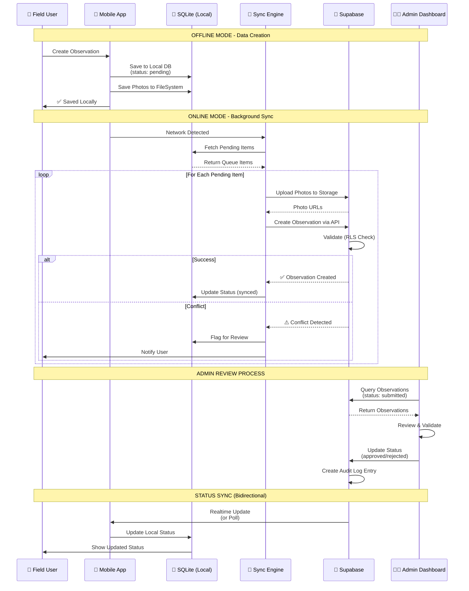
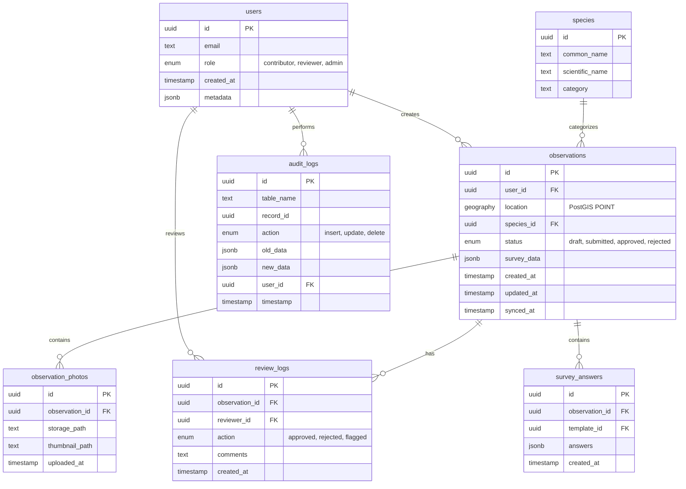

# Tree Observation App - Technical Architecture
*Technical Documentation*

---

## 🎯 FEATURE SCOPE

### **Core Features**
1. **Authentication** - Role-based access (contributor, reviewer, admin)
2. **Tree Management** - Create and revisit tree records with location
3. **Observation Collection** - Field data collection forms
4. **Map Dashboard** - Admin spatial interface with filtering
5. **Bulk Import** - CSV import functionality

---

## 🔧 TECHNOLOGY STACK

### **Mobile / Frontend**
- React Native
- Expo (EAS builds)
- TypeScript
- SQLite (offline database)
- Mapbox / MapLibre

### **Backend**
- Supabase
- Postgres + PostGIS
- PostgREST APIs
- Edge Functions
- Row Level Security (RLS)

### **Ops / Tooling**
- GitHub (version control)
- GitHub Actions (CI/CD)
- Sentry (error tracking)
- Retool (admin panel)

---

## 🎨 System Architecture Diagram

```mermaid
graph TB
    subgraph "📱 CLIENT APPLICATIONS"
        subgraph Mobile["📱 MOBILE APP (iOS)"]
            RN[React Native + Expo]
            RNState[Zustand State Management]
            RNForm[React Hook Form]
            RNNav[Expo Router]
            MapboxNative[Mapbox GL Native<br/>@rnmapbox/maps]
            SQLite[SQLite<br/>expo-sqlite]
            FileSystem[Expo FileSystem]
            AsyncStorage[AsyncStorage]
            SyncEngine[Background Sync Engine<br/>expo-task-manager]
        end
        
        subgraph Web["💻 WEB ADMIN"]
            React[React 18 + Vite<br/>TypeScript]
            WebState[Zustand State]
            TanStack[TanStack Table]
            ReactRouter[React Router v6]
            MapboxJS[Mapbox GL JS<br/>mapbox-gl]
            Shadcn[Shadcn/ui Components]
            Recharts[Recharts]
        end
    end
    
    subgraph "🚀 SUPABASE PLATFORM"
        subgraph Database["🗄️ PostgreSQL 15 + PostGIS"]
            RLS[Row Level Security]
            Realtime[Realtime Subscriptions]
            Triggers[Database Functions & Triggers]
            Tables[Tables:<br/>users, observations,<br/>species, photos,<br/>review_logs, audit_logs]
        end
        
        Auth[🔐 Supabase Auth<br/>JWT Tokens<br/>Email/Password<br/>Role-based Access]
        Storage[📁 Supabase Storage<br/>S3-compatible<br/>Observation Photos<br/>Thumbnails]
        PostgREST[⚡ PostgREST<br/>Auto-generated REST API<br/>OData-like Filtering]
        EdgeFunctions[🔧 Edge Functions<br/>Deno Runtime<br/>Custom Business Logic<br/>Sync Conflict Resolution]
    end
    
    subgraph "🌐 EXTERNAL SERVICES"
        MapboxServices[🗺️ Mapbox Services<br/>Map Tiles API<br/>Geocoding API<br/>Static Tiles]
        Sentry[📊 Sentry<br/>Error Tracking<br/>Performance Monitoring]
        GitHub[🛠️ GitHub + Actions<br/>Version Control<br/>CI/CD Pipeline]
        EAS[📦 Expo EAS Build<br/>iOS Builds<br/>TestFlight]
    end
    
    %% Mobile App Connections
    RN --> RNState
    RN --> RNForm
    RN --> RNNav
    RN --> MapboxNative
    RN --> SQLite
    RN --> FileSystem
    RN --> AsyncStorage
    RN --> SyncEngine
    
    %% Web Admin Connections
    React --> WebState
    React --> TanStack
    React --> ReactRouter
    React --> MapboxJS
    React --> Shadcn
    React --> Recharts
    
    %% Client to Supabase
    Mobile -->|HTTPS| Auth
    Mobile -->|HTTPS| PostgREST
    Mobile -->|HTTPS| Storage
    Mobile -->|HTTPS| EdgeFunctions
    Mobile -->|Sync Queue| SyncEngine
    SyncEngine -->|Background Upload| Storage
    SyncEngine -->|Background Upload| PostgREST
    
    Web -->|HTTPS| Auth
    Web -->|HTTPS| PostgREST
    Web -->|HTTPS| Storage
    Web -->|HTTPS| Realtime
    
    %% Supabase Internal
    PostgREST --> Database
    Auth --> Database
    Storage --> Database
    EdgeFunctions --> Database
    Realtime --> Database
    Database --> RLS
    Database --> Realtime
    Database --> Triggers
    
    %% External Services
    MapboxNative -->|API Calls| MapboxServices
    MapboxJS -->|API Calls| MapboxServices
    Mobile -->|Error Reports| Sentry
    Web -->|Error Reports| Sentry
    GitHub -->|CI/CD| EAS
    GitHub -->|Deploy| Web
    
    %% Styling
    classDef mobileApp fill:#4A90E2,stroke:#2E5C8A,stroke-width:2px,color:#fff
    classDef webApp fill:#61DAFB,stroke:#2E5C8A,stroke-width:2px,color:#000
    classDef backend fill:#3ECF8E,stroke:#2E5C8A,stroke-width:2px,color:#fff
    classDef external fill:#FFD93D,stroke:#2E5C8A,stroke-width:2px,color:#000
    
    class RN,RNState,RNForm,RNNav,MapboxNative,SQLite,FileSystem,AsyncStorage,SyncEngine mobileApp
    class React,WebState,TanStack,ReactRouter,MapboxJS,Shadcn,Recharts webApp
    class Database,RLS,Realtime,Triggers,Tables,Auth,Storage,PostgREST,EdgeFunctions backend
    class MapboxServices,Sentry,GitHub,EAS external
```



---

## 🔄 Data Flow & Offline Sync Diagram



---

## 🏗️ SYSTEM ARCHITECTURE OVERVIEW

```
┌─────────────────────────────────────────────────────────────────────────┐
│                          CLIENT APPLICATIONS                             │
├────────────────────────────────┬────────────────────────────────────────┤
│                                │                                        │
│   📱 MOBILE APP (iOS)          │   💻 WEB ADMIN                        │
│   ┌──────────────────────┐    │   ┌──────────────────────┐           │
│   │  React Native        │    │   │  React (Vite)        │           │
│   │  + Expo              │    │   │  + TypeScript        │           │
│   ├──────────────────────┤    │   ├──────────────────────┤           │
│   │  State: Zustand      │    │   │  State: Zustand      │           │
│   │  Forms: React Hook   │    │   │  Tables: TanStack    │           │
│   │  Navigation: Expo    │    │   │  Router: React Router│           │
│   ├──────────────────────┤    │   ├──────────────────────┤           │
│   │  📍 Mapbox GL Native │    │   │  📍 Mapbox GL JS     │           │
│   │  (react-native-mapbox)│   │   │  (mapbox-gl)         │           │
│   ├──────────────────────┤    │   ├──────────────────────┤           │
│   │  📦 Local Storage    │    │   │  🔐 Auth             │           │
│   │  - SQLite (Expo)     │    │   │  - Supabase Client   │           │
│   │  - Expo FileSystem   │    │   │  - RLS Enforcement   │           │
│   │  - Async Storage     │    │   └──────────────────────┘           │
│   └──────────────────────┘    │                                        │
│                                │                                        │
└────────────────────────────────┴────────────────────────────────────────┘
                                 │
                                 │ HTTPS
                                 ▼
┌─────────────────────────────────────────────────────────────────────────┐
│                          BACKEND SERVICES                                │
├─────────────────────────────────────────────────────────────────────────┤
│                                                                           │
│   🚀 SUPABASE PLATFORM                                                   │
│   ┌─────────────────────────────────────────────────────────────────┐  │
│   │  🗄️  PostgreSQL 15 + PostGIS                                    │  │
│   │  ├── Row Level Security (RLS)                                    │  │
│   │  ├── Realtime Subscriptions                                      │  │
│   │  └── Database Functions & Triggers                               │  │
│   │                                                                   │  │
│   │  Tables:                                                          │  │
│   │  • users                    • observations                       │  │
│   │  • roles                    • observation_photos                 │  │
│   │  • survey_templates         • survey_answers                     │  │
│   │  • species                  • review_logs                        │  │
│   │  • categories               • audit_logs                         │  │
│   └─────────────────────────────────────────────────────────────────┘  │
│                                                                           │
│   ┌─────────────────────────────────────────────────────────────────┐  │
│   │  🔐 Supabase Auth                                                │  │
│   │  • JWT tokens                                                    │  │
│   │  • Email/Password                                                │  │
│   │  • Role-based access (Contributor/Reviewer/Admin)               │  │
│   │  • Session management                                            │  │
│   └─────────────────────────────────────────────────────────────────┘  │
│                                                                           │
│   ┌─────────────────────────────────────────────────────────────────┐  │
│   │  📁 Supabase Storage (S3-compatible)                            │  │
│   │  • Observation photos                                            │  │
│   │  • Thumbnails (auto-generated)                                   │  │
│   │  • RLS policies for access control                              │  │
│   └─────────────────────────────────────────────────────────────────┘  │
│                                                                           │
│   ┌─────────────────────────────────────────────────────────────────┐  │
│   │  ⚡ PostgREST (Auto-generated REST API)                         │  │
│   │  • Auto-generated from DB schema                                 │  │
│   │  • OData-like filtering                                          │  │
│   │  • JWT validation                                                │  │
│   └─────────────────────────────────────────────────────────────────┘  │
│                                                                           │
│   ┌─────────────────────────────────────────────────────────────────┐  │
│   │  🔧 Edge Functions (Deno)                                        │  │
│   │  • Custom business logic                                         │  │
│   │  • Sync conflict resolution                                      │  │
│   │  • Batch processing                                              │  │
│   │  • External API integrations                                     │  │
│   └─────────────────────────────────────────────────────────────────┘  │
│                                                                           │
└─────────────────────────────────────────────────────────────────────────┘
                                 │
                                 │
                                 ▼
┌─────────────────────────────────────────────────────────────────────────┐
│                       EXTERNAL SERVICES                                  │
├─────────────────────────────────────────────────────────────────────────┤
│                                                                           │
│  🗺️  Mapbox Services                                                    │
│  • Mapbox GL JS / Native                                                 │
│  • Static Tiles API (offline caching)                                    │
│  • Geocoding API                                                         │
│  • Directions API (optional)                                             │
│                                                                           │
│  📊 Monitoring & Analytics                                               │
│  • Sentry (error tracking)                                               │
│  • PostHog (optional - analytics)                                        │
│                                                                           │
│  🛠️  Development & Deployment                                           │
│  • GitHub (version control)                                              │
│  • GitHub Actions (CI/CD)                                                │
│  • Expo EAS Build (iOS builds)                                           │
│  • Retool (admin tools - optional)                                       │
│                                                                           │
└─────────────────────────────────────────────────────────────────────────┘
```

---

## 📱 MOBILE APP ARCHITECTURE (React Native + Expo)

### **Technology Stack**

```
┌──────────────────────────────────────────────────┐
│              Mobile App Layers                    │
├──────────────────────────────────────────────────┤
│                                                   │
│  🎨 UI LAYER                                     │
│  ├── React Native Components                     │
│  ├── NativeWind (Tailwind for RN)               │
│  └── Custom Design System                        │
│                                                   │
│  🧠 STATE MANAGEMENT                             │
│  ├── Zustand (global state)                     │
│  ├── React Query (server state)                 │
│  └── React Hook Form (forms)                    │
│                                                   │
│  🗺️  MAP & LOCATION                              │
│  ├── @rnmapbox/maps (Mapbox GL Native)          │
│  ├── expo-location (GPS)                         │
│  ├── Offline tile caching                        │
│  └── GeoJSON rendering                           │
│                                                   │
│  📸 MEDIA HANDLING                                │
│  ├── expo-image-picker                           │
│  ├── expo-camera                                 │
│  ├── expo-file-system (local storage)           │
│  └── Image compression                           │
│                                                   │
│  💾 LOCAL DATA LAYER                             │
│  ├── expo-sqlite (structured data)               │
│  ├── @react-native-async-storage (key-value)    │
│  └── FileSystem (photos)                         │
│                                                   │
│  🔄 SYNC ENGINE                                  │
│  ├── Background sync (expo-task-manager)        │
│  ├── Network detection (expo-network)           │
│  ├── Queue system for uploads                    │
│  └── Conflict resolution                         │
│                                                   │
│  🔌 API LAYER                                    │
│  ├── Supabase JS Client                         │
│  ├── @supabase/supabase-js                      │
│  └── Auth token management                       │
│                                                   │
│  🧭 NAVIGATION                                   │
│  └── Expo Router (file-based routing)           │
│                                                   │
└──────────────────────────────────────────────────┘
```

### **Mobile App Data Flow**

```
USER ACTION → UI Component → State Manager → Data Layer
                                              ↓
                                        Is Online?
                                        ↙        ↘
                                    YES          NO
                                     ↓            ↓
                              Supabase API    SQLite DB
                                     ↓            ↓
                              Update SQLite  Queue for sync
                                              ↓
                                        Background Sync
                                              ↓
                                        Supabase API
```

---

## 💻 WEB ADMIN ARCHITECTURE (React + Vite)

### **Technology Stack**

```
┌──────────────────────────────────────────────────┐
│              Web Admin Layers                     │
├──────────────────────────────────────────────────┤
│                                                   │
│  🎨 UI LAYER                                     │
│  ├── React 18                                    │
│  ├── TypeScript                                  │
│  ├── Tailwind CSS                                │
│  ├── Shadcn/ui (component library)              │
│  └── Lucide Icons                                │
│                                                   │
│  📊 DATA TABLES                                  │
│  ├── TanStack Table (React Table v8)            │
│  ├── Filtering, sorting, pagination              │
│  ├── Virtual scrolling                           │
│  └── Bulk actions                                │
│                                                   │
│  🗺️  MAP COMPONENTS                              │
│  ├── mapbox-gl                                   │
│  ├── react-map-gl                                │
│  ├── Cluster visualization                       │
│  └── Interactive markers                         │
│                                                   │
│  📈 CHARTS & VISUALIZATION                       │
│  ├── Recharts                                    │
│  ├── Victory (optional)                          │
│  └── Custom D3 components                        │
│                                                   │
│  🧠 STATE MANAGEMENT                             │
│  ├── Zustand (global state)                     │
│  ├── TanStack Query (React Query)               │
│  └── React Hook Form                             │
│                                                   │
│  🔌 API LAYER                                    │
│  ├── Supabase JS Client                         │
│  ├── RESTful API calls                           │
│  └── Real-time subscriptions                     │
│                                                   │
│  🧭 ROUTING                                      │
│  └── React Router v6                             │
│                                                   │
│  ⚙️  BUILD TOOL                                  │
│  └── Vite                                        │
│                                                   │
└──────────────────────────────────────────────────┘
```

### **Web Admin Pages Structure**

```
/admin
  ├── /dashboard          → Summary stats, charts
  ├── /observations       → Data table with filters
  │   └── /:id           → Detail view for review
  ├── /map               → Spatial review interface
  ├── /species           → Reference data management
  ├── /users             → User management
  ├── /import            → CSV import tool
  ├── /audit-log         → Change history
  └── /settings          → System configuration
```

---

## 🗄️ DATABASE SCHEMA (PostgreSQL + PostGIS)

### **Entity Relationship Diagram**



### **SQL Schema Structure**

```sql
-- Core Tables Structure

┌────────────────────────────────────────────────────────┐
│  users                                                  │
├────────────────────────────────────────────────────────┤
│  id (uuid, PK)                                         │
│  email (text)                                          │
│  role (enum: contributor, reviewer, admin)             │
│  created_at (timestamp)                                │
│  metadata (jsonb)                                      │
└────────────────────────────────────────────────────────┘
                       │
                       │ 1:many
                       ▼
┌────────────────────────────────────────────────────────┐
│  observations                                           │
├────────────────────────────────────────────────────────┤
│  id (uuid, PK)                                         │
│  user_id (uuid, FK → users)                           │
│  location (geography(POINT, 4326))  ← PostGIS         │
│  species_id (uuid, FK → species)                      │
│  status (enum: draft, submitted, approved, rejected)   │
│  survey_data (jsonb)                                   │
│  created_at (timestamp)                                │
│  updated_at (timestamp)                                │
│  synced_at (timestamp)                                 │
└────────────────────────────────────────────────────────┘
                       │
                       │ 1:many
                       ▼
┌────────────────────────────────────────────────────────┐
│  observation_photos                                     │
├────────────────────────────────────────────────────────┤
│  id (uuid, PK)                                         │
│  observation_id (uuid, FK → observations)             │
│  storage_path (text)                                   │
│  thumbnail_path (text)                                 │
│  uploaded_at (timestamp)                               │
└────────────────────────────────────────────────────────┘

┌────────────────────────────────────────────────────────┐
│  species (reference data)                              │
├────────────────────────────────────────────────────────┤
│  id (uuid, PK)                                         │
│  common_name (text)                                    │
│  scientific_name (text)                                │
│  category (text)                                       │
└────────────────────────────────────────────────────────┘

┌────────────────────────────────────────────────────────┐
│  review_logs                                            │
├────────────────────────────────────────────────────────┤
│  id (uuid, PK)                                         │
│  observation_id (uuid, FK → observations)             │
│  reviewer_id (uuid, FK → users)                       │
│  action (enum: approved, rejected, flagged)            │
│  comments (text)                                       │
│  created_at (timestamp)                                │
└────────────────────────────────────────────────────────┘

┌────────────────────────────────────────────────────────┐
│  audit_logs                                             │
├────────────────────────────────────────────────────────┤
│  id (uuid, PK)                                         │
│  table_name (text)                                     │
│  record_id (uuid)                                      │
│  action (enum: insert, update, delete)                 │
│  old_data (jsonb)                                      │
│  new_data (jsonb)                                      │
│  user_id (uuid, FK → users)                           │
│  timestamp (timestamp)                                 │
└────────────────────────────────────────────────────────┘
```

### **PostGIS Queries Examples**

```sql
-- Find observations within 10km of a point
SELECT * FROM observations
WHERE ST_DWithin(
  location,
  ST_SetSRID(ST_MakePoint(-122.4194, 37.7749), 4326)::geography,
  10000
);

-- Cluster observations for map display
SELECT
  ST_AsGeoJSON(ST_Centroid(ST_Collect(location))) as center,
  COUNT(*) as count
FROM observations
WHERE status = 'approved'
GROUP BY ST_SnapToGrid(location, 0.01);
```

---

## 🔄 OFFLINE SYNC ARCHITECTURE

```
┌─────────────────────────────────────────────────────┐
│              OFFLINE-FIRST FLOW                      │
└─────────────────────────────────────────────────────┘

1️⃣  DATA CREATION (Offline)
┌──────────────┐
│ User creates │
│ observation  │
└──────┬───────┘
       │
       ▼
┌──────────────────────┐
│ Save to SQLite       │
│ • observations_local │
│ • status: "pending"  │
│ • uuid generated     │
└──────┬───────────────┘
       │
       ▼
┌──────────────────────┐
│ Save photos to       │
│ FileSystem           │
│ • Local path stored  │
└──────────────────────┘


2️⃣  SYNC TRIGGER (Online)
┌──────────────────────┐
│ Network detected     │
└──────┬───────────────┘
       │
       ▼
┌──────────────────────┐
│ Background Task      │
│ (expo-task-manager)  │
└──────┬───────────────┘
       │
       ▼
┌──────────────────────┐
│ Fetch pending items  │
│ from SQLite          │
└──────┬───────────────┘


3️⃣  UPLOAD PROCESS
       │
       ▼
┌──────────────────────┐
│ Upload photos        │
│ to Supabase Storage  │
└──────┬───────────────┘
       │
       ▼
┌──────────────────────┐
│ Create observation   │
│ record via API       │
│ (with photo URLs)    │
└──────┬───────────────┘
       │
       ▼
┌──────────────────────┐
│ Update local record  │
│ • status: "synced"   │
│ • server_id stored   │
└──────┬───────────────┘


4️⃣  CONFLICT RESOLUTION
       │
       ▼
┌──────────────────────┐
│ Server validation    │
│ • RLS check          │
│ • Duplicate check    │
└──────┬───────────────┘
       │
       ├─ Success ──────────┐
       │                    │
       └─ Conflict ─────────┤
                            ▼
                    ┌──────────────────┐
                    │ Flag for review  │
                    │ Keep local copy  │
                    │ Notify user      │
                    └──────────────────┘


5️⃣  STATUS SYNC (Bidirectional)
┌──────────────────────┐
│ Poll for updates     │
│ (or use Realtime)    │
└──────┬───────────────┘
       │
       ▼
┌──────────────────────┐
│ Fetch status changes │
│ from server          │
└──────┬───────────────┘
       │
       ▼
┌──────────────────────┐
│ Update local SQLite  │
│ with new status      │
└──────────────────────┘
```

### **Sync Queue Implementation**

```typescript
// Simplified sync architecture

interface SyncQueueItem {
  id: string;
  type: 'observation' | 'photo';
  localId: string;
  status: 'pending' | 'uploading' | 'completed' | 'failed';
  retryCount: number;
  createdAt: Date;
}

// Background sync process
const syncQueue = {
  async processQueue() {
    const items = await getLocalPendingItems();
    
    for (const item of items) {
      try {
        if (item.type === 'photo') {
          await uploadPhoto(item);
        } else {
          await uploadObservation(item);
        }
        
        await markAsSynced(item.localId);
      } catch (error) {
        await handleSyncError(item, error);
      }
    }
  }
};
```

---

## 🔐 SECURITY ARCHITECTURE

### **Row-Level Security (RLS) Policies**

```sql
-- Contributors can only see their own observations
CREATE POLICY "contributors_own_data"
ON observations FOR ALL
TO authenticated
USING (auth.uid() = user_id)
WITH CHECK (auth.uid() = user_id);

-- Reviewers can see all submitted observations
CREATE POLICY "reviewers_read_submitted"
ON observations FOR SELECT
TO authenticated
USING (
  EXISTS (
    SELECT 1 FROM users
    WHERE users.id = auth.uid()
    AND users.role IN ('reviewer', 'admin')
  )
  AND status IN ('submitted', 'approved', 'rejected')
);

-- Admins can do everything
CREATE POLICY "admins_all_access"
ON observations FOR ALL
TO authenticated
USING (
  EXISTS (
    SELECT 1 FROM users
    WHERE users.id = auth.uid()
    AND users.role = 'admin'
  )
);
```

### **Authentication Flow**

```
Mobile/Web App
      │
      ▼
┌─────────────────┐
│ Supabase Auth   │
│ • Email/Password│
│ • JWT tokens    │
└────────┬────────┘
         │
         ▼
┌─────────────────┐
│ JWT Validation  │
│ • Verify token  │
│ • Extract role  │
└────────┬────────┘
         │
         ▼
┌─────────────────┐
│ RLS Enforcement │
│ • Query filtering│
│ • Auto-applied  │
└─────────────────┘
```

---

## 📊 DATA FLOW DIAGRAMS

### **Complete End-to-End Flow**

```
FIELD USER                    SYSTEM                      ADMIN

    │                                                        │
    ├─ 1. Create observation                                │
    │     (offline)                                          │
    │                                                        │
    ▼                                                        │
┌─────────┐                                                 │
│ SQLite  │                                                 │
│ storage │                                                 │
└────┬────┘                                                 │
     │                                                       │
     ├─ 2. Network available                                │
     │                                                       │
     ▼                                                       │
┌──────────────┐                                            │
│ Sync process │                                            │
└──────┬───────┘                                            │
       │                                                     │
       ├─ 3. Upload photos                                  │
       │                                                     │
       ▼                                                     │
┌─────────────────┐                                         │
│ Supabase Storage│                                         │
└──────┬──────────┘                                         │
       │                                                     │
       ├─ 4. Create record                                  │
       │                                                     │
       ▼                                                     │
┌─────────────────┐                                         │
│ PostgreSQL      │                                         │
│ + PostGIS       │◄────────5. Query observations──────────┤
└──────┬──────────┘                                         │
       │                                                     │
       │                                                     ▼
       │                                          ┌─────────────────┐
       │                                          │ Admin Dashboard │
       │                                          │ • Review        │
       │                                          │ • Approve       │
       │                                          └────────┬────────┘
       │                                                   │
       │                                                   │
       │◄────────────6. Update status───────────────────────┤
       │                                                   │
       ▼                                                   │
┌──────────────┐                                           │
│ Status sync  │                                           │
│ to mobile    │                                           │
└──────┬───────┘                                           │
       │                                                   │
       ▼                                                   ▼
┌─────────────┐                                  ┌─────────────────┐
│ Update      │                                  │ Audit log entry │
│ SQLite      │                                  └─────────────────┘
└─────────────┘
```

---

## 🛠️ DEVELOPMENT & DEPLOYMENT PIPELINE

```
┌──────────────────────────────────────────────────────┐
│              DEVELOPMENT WORKFLOW                     │
└──────────────────────────────────────────────────────┘

LOCAL DEVELOPMENT
├── Mobile App
│   ├── npm run start (Expo dev server)
│   ├── iOS Simulator / Physical device
│   └── Hot reload enabled
│
├── Web Admin
│   ├── npm run dev (Vite dev server)
│   ├── localhost:5173
│   └── HMR enabled
│
└── Supabase
    ├── Local instance (optional)
    └── Cloud dev project


VERSION CONTROL
└── GitHub
    ├── main branch (production)
    ├── develop branch (staging)
    └── feature/* branches


CI/CD PIPELINE (GitHub Actions)
└── On push to main/develop
    │
    ├── Mobile App
    │   ├── Run tests
    │   ├── Lint & type check
    │   ├── Build with EAS
    │   └── Submit to TestFlight
    │
    ├── Web Admin
    │   ├── Run tests
    │   ├── Lint & type check
    │   ├── Build (Vite)
    │   └── Deploy to Vercel/Netlify
    │
    └── Database
        ├── Run migrations
        └── Seed data (dev only)


MONITORING
├── Sentry
│   ├── Error tracking
│   ├── Performance monitoring
│   └── Release tracking
│
└── Supabase Dashboard
    ├── Database metrics
    ├── Storage usage
    └── API logs
```

---

## 🎯 KEY INTEGRATIONS

### **1. Mapbox Integration**

```javascript
// Mobile (React Native)
import Mapbox from '@rnmapbox/maps';

// Offline tile caching
const offlinePack = await Mapbox.offlineManager.createPack({
  name: 'observation-area',
  styleURL: Mapbox.StyleURL.Outdoors,
  bounds: [[west, south], [east, north]],
  minZoom: 10,
  maxZoom: 16
});

// Web Admin
import mapboxgl from 'mapbox-gl';
import 'mapbox-gl/dist/mapbox-gl.css';

const map = new mapboxgl.Map({
  container: 'map',
  style: 'mapbox://styles/mapbox/outdoors-v12',
  center: [lng, lat],
  zoom: 12
});
```

### **2. Supabase Client Setup**

```typescript
// Shared config
import { createClient } from '@supabase/supabase-js';

const supabase = createClient(
  process.env.SUPABASE_URL,
  process.env.SUPABASE_ANON_KEY
);

// Auth
const { data, error } = await supabase.auth.signInWithPassword({
  email,
  password
});

// Queries with RLS
const { data: observations } = await supabase
  .from('observations')
  .select('*, species(*), observation_photos(*)')
  .eq('status', 'submitted')
  .order('created_at', { ascending: false });

// Storage
const { data, error } = await supabase.storage
  .from('observation-photos')
  .upload(`${observationId}/${fileName}`, file);

// Realtime
const channel = supabase
  .channel('observation-changes')
  .on('postgres_changes', 
    { event: '*', schema: 'public', table: 'observations' },
    (payload) => console.log(payload)
  )
  .subscribe();
```

### **3. SQLite (Mobile Offline Storage)**

```typescript
import * as SQLite from 'expo-sqlite';

const db = SQLite.openDatabase('observations.db');

// Initialize schema
db.transaction(tx => {
  tx.executeSql(`
    CREATE TABLE IF NOT EXISTS observations_local (
      id TEXT PRIMARY KEY,
      user_id TEXT,
      location TEXT,
      species_id TEXT,
      survey_data TEXT,
      status TEXT,
      synced INTEGER DEFAULT 0,
      created_at TEXT
    )
  `);
});

// Insert observation
const insertObservation = async (observation) => {
  return new Promise((resolve, reject) => {
    db.transaction(tx => {
      tx.executeSql(
        'INSERT INTO observations_local VALUES (?, ?, ?, ?, ?, ?, ?, ?)',
        [
          observation.id,
          observation.userId,
          JSON.stringify(observation.location),
          observation.speciesId,
          JSON.stringify(observation.surveyData),
          'pending',
          0,
          new Date().toISOString()
        ],
        (_, result) => resolve(result),
        (_, error) => reject(error)
      );
    });
  });
};
```

---

## 📦 PROJECT STRUCTURE

### **Mobile App (React Native + Expo)**

```
mobile-app/
├── app/                          # Expo Router (file-based routing)
│   ├── (auth)/
│   │   ├── login.tsx
│   │   └── register.tsx
│   ├── (tabs)/
│   │   ├── index.tsx            # Observation list
│   │   ├── map.tsx              # Map view
│   │   └── profile.tsx
│   ├── observation/
│   │   ├── [id].tsx             # Detail view
│   │   └── create.tsx           # New observation
│   └── _layout.tsx
├── components/
│   ├── Map/
│   │   ├── ObservationMap.tsx
│   │   ├── MarkerCluster.tsx
│   │   └── OfflineMapManager.tsx
│   ├── Observation/
│   │   ├── ObservationCard.tsx
│   │   ├── SurveyForm.tsx
│   │   └── PhotoUpload.tsx
│   └── UI/
│       ├── Button.tsx
│       ├── Input.tsx
│       └── StatusBadge.tsx
├── lib/
│   ├── supabase.ts              # Supabase client
│   ├── sqlite.ts                # Local database
│   └── sync.ts                  # Sync engine
├── store/
│   ├── auth.ts                  # Zustand auth store
│   ├── observations.ts          # Observations store
│   └── sync.ts                  # Sync queue store
├── types/
│   └── database.types.ts        # Supabase generated types
├── app.json
└── package.json
```

### **Web Admin (React + Vite)**

```
web-admin/
├── src/
│   ├── pages/
│   │   ├── Dashboard.tsx
│   │   ├── ObservationsList.tsx
│   │   ├── ObservationDetail.tsx
│   │   ├── MapView.tsx
│   │   ├── SpeciesManagement.tsx
│   │   ├── Import.tsx
│   │   └── AuditLog.tsx
│   ├── components/
│   │   ├── DataTable/
│   │   │   ├── DataTable.tsx
│   │   │   ├── Filters.tsx
│   │   │   └── Pagination.tsx
│   │   ├── Map/
│   │   │   ├── AdminMap.tsx
│   │   │   └── ClusterMarkers.tsx
│   │   ├── Review/
│   │   │   ├── ReviewPanel.tsx
│   │   │   └── ApprovalActions.tsx
│   │   └── ui/
│   │       └── [shadcn components]
│   ├── lib/
│   │   ├── supabase.ts
│   │   └── utils.ts
│   ├── hooks/
│   │   ├── useObservations.ts
│   │   └── useAuth.ts
│   ├── types/
│   │   └── database.types.ts
│   ├── App.tsx
│   └── main.tsx
├── index.html
├── vite.config.ts
└── package.json
```

---

## 🚀 PERFORMANCE OPTIMIZATIONS

### **Mobile App**
- Virtualized lists (FlashList)
- Image lazy loading & caching
- Map marker clustering
- Optimistic UI updates
- Debounced search
- Background sync throttling

### **Web Admin**
- Virtual scrolling (TanStack Virtual)
- Lazy loading routes
- Memoized calculations
- Web Workers for heavy processing
- Progressive loading for large datasets

### **Database**
- PostGIS spatial indexes
- Compound indexes on frequently queried columns
- Materialized views for dashboard stats
- Query optimization with EXPLAIN ANALYZE

---

## 📈 SCALABILITY CONSIDERATIONS

```
Current (Phase 1)          Future Scaling
├── Single region         → Multi-region (Supabase)
├── Manual review         → ML-assisted review
├── iOS only             → Android + Web PWA
├── Basic analytics      → Advanced BI dashboards
└── 10K observations     → Millions of records
```

---

## 📋 TECHNICAL DELIVERABLES

### **Core Components**

1. **Authentication System**
   - Mobile login with role-based access
   - Supabase Auth integration
   - RLS policies implementation

2. **Tree Management**
   - Create tree records
   - Revisit existing trees
   - Location capture (PostGIS)

3. **Observation Collection**
   - Field data forms
   - Photo capture and storage
   - Offline-first data entry

4. **Sync Engine**
   - Background sync
   - Conflict resolution
   - Status indicators

5. **Admin Dashboard (Web)**
   - Map view with filtering
   - Observation review interface
   - Bulk import functionality

### **Documentation**

- ERD diagram
- API flow diagram
- Sync flow diagram
- RLS policy overview
- Deployment instructions

---

## ✅ ARCHITECTURE SUMMARY

### **Key Boxes to Create:**

1. **Mobile App Stack**
   - React Native + Expo
   - Mapbox GL Native
   - SQLite
   - Sync Engine

2. **Web Admin Stack**
   - React + Vite
   - TanStack Table
   - Mapbox GL JS
   - Shadcn/ui

3. **Backend (Supabase)**
   - PostgreSQL + PostGIS
   - Auth (JWT + RLS)
   - Storage (S3)
   - PostgREST API
   - Edge Functions

4. **External Services**
   - Mapbox (tiles, geocoding)
   - Sentry (monitoring)
   - GitHub + Actions (CI/CD)
   - Expo EAS (builds)

5. **Data Flow Arrows**
   - User → SQLite → Sync → Supabase
   - Admin → API → PostgreSQL
   - Status updates (bidirectional)

### **Color Coding Suggestion:**
- 🟦 Blue: Frontend (Mobile/Web)
- 🟩 Green: Backend/Database
- 🟨 Yellow: External Services
- 🟥 Red: Critical paths (sync, auth)

---

*This architecture supports offline-first data collection, real-time review workflows, and future analytics capabilities.*
