# Tree Observation App - Complete System Design Diagram

## 🏗️ Full System Architecture

```mermaid
flowchart TB
    subgraph CLIENT["📱 CLIENT LAYER"]
        MobileApp[📱 Mobile App iOS<br/>━━━━━━━━━━━━━━━━━━━━<br/>React Native + Expo<br/>• UI Components & NativeWind<br/>• Zustand & React Query<br/>• Mapbox GL Native<br/>• Image Picker & Camera<br/>• SQLite & FileSystem<br/>• Sync Queue Engine<br/>• Supabase Client]
        
        WebAdmin[💻 Web Admin Dashboard<br/>━━━━━━━━━━━━━━━━━━━━<br/>React 18 + Vite + TypeScript<br/>• Shadcn/ui Components<br/>• TanStack Table & Query<br/>• Mapbox GL JS<br/>• Recharts Visualization<br/>• Supabase Client<br/>• Realtime Subscriptions]
    end
    
    subgraph SUPABASE["🚀 SUPABASE PLATFORM"]
        AuthService[🔐 Authentication Service<br/>━━━━━━━━━━━━━━━━━━━━<br/>• Supabase Auth<br/>• JWT Tokens<br/>• Email/Password<br/>• Role-based Access<br/>• Session Management]
        
        Database[(🗄️ PostgreSQL + PostGIS<br/>━━━━━━━━━━━━━━━━━━━━<br/>• Core Tables<br/>• Spatial Data<br/>• Row Level Security<br/>• Realtime Subscriptions<br/>• Triggers & Functions<br/>• Spatial Indexes)]
        
        StorageService[📁 Storage Service<br/>━━━━━━━━━━━━━━━━━━━━<br/>• S3-compatible<br/>• Photo Buckets<br/>• Thumbnails<br/>• RLS Policies<br/>• Signed URLs]
        
        APIService[⚡ API Services<br/>━━━━━━━━━━━━━━━━━━━━<br/>• PostgREST<br/>• Auto CRUD<br/>• OData Filtering<br/>• JWT Validation]
        
        EdgeService[🔧 Edge Functions<br/>━━━━━━━━━━━━━━━━━━━━<br/>• Deno Runtime<br/>• Sync Conflict Resolution<br/>• Batch Processing<br/>• External APIs]
    end
    
    subgraph EXTERNAL["🌐 EXTERNAL SERVICES"]
        MapboxServices[🗺️ Mapbox Services<br/>━━━━━━━━━━━━━━━━━━━━<br/>• Map Tiles API<br/>• Geocoding API<br/>• Static Tiles<br/>• Directions API]
        
        Monitoring[📊 Monitoring<br/>━━━━━━━━━━━━━━━━━━━━<br/>• Sentry Error Tracking<br/>• Performance Monitoring<br/>• PostHog Analytics]
        
        DevOps[🛠️ DevOps & CI/CD<br/>━━━━━━━━━━━━━━━━━━━━<br/>• GitHub Version Control<br/>• GitHub Actions CI/CD<br/>• Expo EAS Builds<br/>• Vercel/Netlify Deployment]
        
        AdminTools[🔧 Admin Tools<br/>━━━━━━━━━━━━━━━━━━━━<br/>• Retool Dashboard]
    end
    
    %% Main Architecture Connections
    MobileApp -->|HTTPS| AuthService
    MobileApp -->|HTTPS| APIService
    MobileApp -->|HTTPS| StorageService
    MobileApp -->|HTTPS| EdgeService
    MobileApp -->|Uses| MapboxServices
    MobileApp -->|Reports| Monitoring
    
    WebAdmin -->|HTTPS| AuthService
    WebAdmin -->|HTTPS| APIService
    WebAdmin -->|HTTPS| StorageService
    WebAdmin -->|HTTPS| Database
    WebAdmin -->|Uses| MapboxServices
    WebAdmin -->|Reports| Monitoring
    
    AuthService -->|Validates| Database
    APIService -->|Queries| Database
    APIService -->|Applies| Database
    StorageService -->|Enforces| Database
    EdgeService -->|Accesses| Database
    
    DevOps -->|Builds| MobileApp
    DevOps -->|Deploys| WebAdmin
    
    AdminTools -->|Connects| APIService
    
    %% Styling
    classDef mobileApp fill:#4A90E2,stroke:#2E5C8A,stroke-width:4px,color:#fff
    classDef webApp fill:#61DAFB,stroke:#2E5C8A,stroke-width:4px,color:#000
    classDef backend fill:#3ECF8E,stroke:#2E5C8A,stroke-width:4px,color:#fff
    classDef external fill:#FFD93D,stroke:#2E5C8A,stroke-width:4px,color:#000
    classDef storage fill:#9B59B6,stroke:#2E5C8A,stroke-width:4px,color:#fff
    classDef security fill:#E74C3C,stroke:#2E5C8A,stroke-width:4px,color:#fff
    
    class MobileApp mobileApp
    class WebAdmin webApp
    class Database,APIService,EdgeService backend
    class AuthService security
    class StorageService storage
    class MapboxServices,Monitoring,DevOps,AdminTools external
```


---

## 🔄 Complete Data Flow Diagram

```mermaid
flowchart TD
    Start([Start]) --> MobileApp[📱 Mobile App]
    
    MobileApp --> Login[Login]
    Login --> JWTToken[🔐 JWT Token]
    JWTToken --> RLSPolicies[RLS Policies]
    RLSPolicies --> Authentication[Authentication]
    Authentication --> RoleCheck[Role Check]
    RoleCheck --> AccessControl[Access Control]
    AccessControl --> WebAdmin[💻 Web Admin]
    
    MobileApp --> TreeObservations[🌳 Tree Observations]
    MobileApp --> PhotoCapture[📸 Photo Capture]
    
    TreeObservations --> SQLiteDB[(SQLite DB<br/>Local Cache)]
    PhotoCapture --> FileSystem[📁 FileSystem<br/>Local Storage]
    
    FileSystem --> GPSLocation[📍 GPS Location]
    FileSystem --> Upload[⬆️ Upload]
    
    GPSLocation --> CachedMaps[🗺️ Cached Maps]
    CachedMaps --> OfflineMaps[Offline Maps]
    OfflineMaps --> Validation[✅ Validation]
    
    SQLiteDB --> NetworkCheck{🌐 Network<br/>Available?}
    
    NetworkCheck -->|NO| QueueSync[📋 Queue for Sync]
    QueueSync --> WaitNetwork[⏳ Wait for Network]
    WaitNetwork --> NetworkCheck
    
    NetworkCheck -->|YES| SyncEngine[🔄 Sync Engine]
    SyncEngine --> ProcessQueue[Process Queue]
    ProcessQueue --> PostgreSQL[(PostgreSQL + PostGIS<br/>Data Storage)]
    
    Upload --> PhotoSync[📤 Photo Sync]
    PhotoSync --> S3Storage[(S3 Storage<br/>Cloud Storage)]
    S3Storage --> GalleryView[🖼️ Gallery View]
    GalleryView --> ReviewPhotos[Review Photos]
    ReviewPhotos --> WebAdmin
    
    Validation --> CoordinateCheck[📍 Coordinate Check]
    CoordinateCheck --> PostGIS[🗺️ PostGIS]
    PostGIS --> SpatialData[Spatial Data]
    SpatialData --> MapDashboard[🗺️ Map Dashboard]
    MapDashboard --> Visualize[👁️ Visualize]
    Visualize --> Heatmaps[🔥 Heatmaps]
    Heatmaps --> DensityAnalysis[Density Analysis]
    
    PostgreSQL --> WebAdmin
    WebAdmin --> ReviewData[📊 Review Data]
    ReviewData --> Analytics[📈 Analytics]
    Analytics --> Reports[📄 Reports]
    
    Reports --> End([End])
    DensityAnalysis --> End
    
    %% Styling
    classDef mobile fill:#4A90E2,stroke:#2E5C8A,stroke-width:3px,color:#fff
    classDef storage fill:#9B59B6,stroke:#2E5C8A,stroke-width:3px,color:#fff
    classDef backend fill:#3ECF8E,stroke:#2E5C8A,stroke-width:3px,color:#fff
    classDef web fill:#61DAFB,stroke:#2E5C8A,stroke-width:3px,color:#000
    classDef security fill:#E74C3C,stroke:#2E5C8A,stroke-width:3px,color:#fff
    classDef decision fill:#FFD93D,stroke:#2E5C8A,stroke-width:3px,color:#000
    classDef process fill:#3498DB,stroke:#2E5C8A,stroke-width:2px,color:#fff
    
    class MobileApp,TreeObservations,PhotoCapture,FileSystem,GPSLocation,CachedMaps,OfflineMaps,Upload,QueueSync,WaitNetwork mobile
    class SQLiteDB,S3Storage,FileSystem storage
    class PostgreSQL,PostGIS,SyncEngine,ProcessQueue,PhotoSync backend
    class WebAdmin,GalleryView,ReviewPhotos,ReviewData,Analytics,Reports,MapDashboard,Visualize,Heatmaps,DensityAnalysis web
    class JWTToken,RLSPolicies,Authentication,RoleCheck,AccessControl security
    class NetworkCheck,Validation,CoordinateCheck decision
    class Login,Start,End process
```



### **Data Flow Stages**

#### **1. Authentication & Access Control**
- User logs into Mobile App
- JWT Token generated and validated
- RLS Policies enforce security
- Role Check determines access level
- Access Control granted to Web Admin

#### **2. Mobile Data Collection**
- **Tree Observations**: Captured and stored in SQLite DB (Local Cache)
- **Photo Capture**: Stored in FileSystem (Local Storage)
- **GPS Location**: Captured and used for map caching

#### **3. Offline Capabilities**
- **Cached Maps**: GPS location enables offline map functionality
- **Offline Maps**: Available for validation without network
- **Local Cache**: SQLite DB stores observations offline
- **Local Storage**: FileSystem stores photos offline

#### **4. Network Detection & Sync Queue**
- System checks if network is available
- If **NO**: Data goes to Queue for Sync → Wait for Network → Re-check
- If **YES**: Data proceeds to Sync Engine

#### **5. Synchronization Process**
- Sync Engine processes the queue
- Observations synced to PostgreSQL + PostGIS
- Photos uploaded to S3 Storage (Cloud Storage)
- Gallery View displays synced photos

#### **6. Spatial Data Processing**
- Validation performs Coordinate Check
- PostGIS processes Spatial Data
- Map Dashboard visualizes data
- Heatmaps show Density Analysis

#### **7. Web Administration**
- Web Admin receives data from PostgreSQL
- Review Photos from Gallery View
- Review Data processed by Analytics
- Reports generated for analysis

#### **8. Visualization & Analytics**
- Map Dashboard provides spatial visualization
- Heatmaps show observation density
- Analytics processes reviewed data
- Reports generated for stakeholders

---

## 📊 System Components Overview

### **Client Layer**

#### **Mobile App (iOS)**
- **UI Layer**: React Native with Expo, NativeWind for styling
- **State Management**: Zustand for global state, React Query for server state, React Hook Form for forms
- **Mapping**: Mapbox GL Native with offline tile caching and GeoJSON rendering
- **Media**: Image picker, camera, and compression utilities
- **Local Storage**: SQLite for structured data, AsyncStorage for key-value, FileSystem for photos
- **Sync Engine**: Background sync with queue management, network detection, and conflict resolution
- **API**: Supabase client with auth token management
- **Navigation**: Expo Router for file-based routing

#### **Web Admin Dashboard**
- **UI Layer**: React 18 with Vite, TypeScript, Tailwind CSS, Shadcn/ui components
- **State Management**: Zustand, TanStack Query, React Hook Form
- **Data Tables**: TanStack Table with filtering, sorting, pagination, and virtual scrolling
- **Mapping**: Mapbox GL JS with clustering and interactive markers
- **Visualization**: Recharts and custom D3 components
- **API**: Supabase client with realtime subscriptions
- **Routing**: React Router v6

### **Supabase Platform**

#### **Authentication Service**
- JWT token management
- Email/Password authentication
- Role-based access control (Contributor, Reviewer, Admin)
- Session management

#### **Database (PostgreSQL + PostGIS)**
- **Core Tables**: users, observations, observation_photos, species, review_logs, audit_logs
- **PostGIS**: Spatial data storage and queries (geography POINT, SRID 4326)
- **Row Level Security**: Policies enforcing role-based data access
- **Realtime**: Subscriptions for live updates
- **Indexes**: GIST spatial indexes, B-Tree indexes, composite indexes
- **Triggers & Functions**: Automated database logic

#### **Storage Service**
- S3-compatible storage
- Separate buckets for photos and thumbnails
- RLS policies for access control
- Short-lived signed URLs for secure access

#### **API Services**
- PostgREST auto-generated REST API
- OData-like filtering capabilities
- JWT validation on all requests
- Automatic CRUD operations

#### **Edge Functions**
- Deno runtime for custom business logic
- Sync conflict resolution
- Batch processing capabilities
- External API integrations

### **External Services**

#### **Mapbox Services**
- Map tiles API for rendering
- Geocoding API for address lookups
- Static tiles API for offline caching
- Directions API (optional)

#### **Monitoring & Analytics**
- Sentry for error tracking and performance monitoring
- PostHog for analytics (optional)

#### **DevOps & CI/CD**
- GitHub for version control
- GitHub Actions for CI/CD pipeline
- Expo EAS for iOS builds and TestFlight distribution
- Vercel/Netlify for web deployment

#### **Admin Tools**
- Retool for admin dashboard and data management

---

## 🔄 Key Data Flows

### **1. Offline Data Creation (Mobile)**
```
User Input → React Components → Zustand Store → SQLite Database
                                    ↓
                            FileSystem (Photos)
                                    ↓
                            Sync Queue (Pending)
```

### **2. Background Sync (Mobile)**
```
Network Detected → Sync Queue → Upload Photos to Storage
                                    ↓
                            Create Observation via API
                                    ↓
                            Update SQLite (Synced)
```

### **3. Admin Review (Web)**
```
Admin Dashboard → PostgREST API → PostgreSQL
                                    ↓
                            Query Observations
                                    ↓
                            Update Status
                                    ↓
                            Create Audit Log
```

### **4. Realtime Updates**
```
PostgreSQL Change → Realtime Subscription → Web Dashboard
                                    ↓
                            Mobile App (Poll/Realtime)
                                    ↓
                            Update Local SQLite
```

---

## 🔐 Security Architecture

### **Authentication Flow**
```
Client → Supabase Auth → JWT Token → PostgREST → RLS Policies → Database
```

### **Row Level Security**
- **Contributors**: Can only access their own observations
- **Reviewers**: Can read all submitted observations, can approve/reject
- **Admins**: Full access to all data and system management

### **Storage Security**
- Private buckets with RLS policies
- Short-lived signed URLs (expires after set time)
- Path-based access control tied to database records

---

## 📈 Performance Optimizations

### **Mobile App**
- Virtualized lists (FlashList)
- Image lazy loading & caching
- Map marker clustering
- Optimistic UI updates
- Debounced search
- Background sync throttling

### **Web Admin**
- Virtual scrolling (TanStack Virtual)
- Lazy loading routes
- Memoized calculations
- Web Workers for heavy processing
- Progressive loading for large datasets

### **Database**
- PostGIS spatial indexes (GIST)
- Compound indexes on frequently queried columns
- Materialized views for dashboard stats
- Query optimization with EXPLAIN ANALYZE

---

## 🚀 Scalability Considerations

### **Current Architecture (Phase 1)**
- Single region deployment
- Manual review process
- iOS only
- Basic analytics
- ~10K observations capacity

### **Future Scaling**
- Multi-region Supabase deployment
- ML-assisted review
- Android + Web PWA support
- Advanced BI dashboards
- Millions of records capacity

---

*This comprehensive system design diagram represents the complete architecture of the Tree Observation App, including all layers, services, data flows, and integrations.*

