# Tree Observation App - System Design

## 🎯 System Overview

A mobile-first tree observation application that enables field workers to collect tree data offline, with automatic synchronization to a cloud database for review and analysis.

**Key Features:**
- Offline-first mobile data collection
- Real-time web admin dashboard
- Spatial data processing with PostGIS
- Role-based access control
- Background sync engine

---

## 🏗️ Complete System Architecture

```mermaid
flowchart TB
    subgraph LAYER1["📱 PRESENTATION LAYER"]
        direction LR
        MobileApp[📱 Mobile App iOS<br/>━━━━━━━━━━━━━━━━━━━━━━━━━━━━━━━━<br/>React Native + Expo<br/>━━━━━━━━━━━━━━━━━━━━━━━━━━━━━━━━<br/>• UI: React Components, NativeWind<br/>• State: Zustand, React Query<br/>• Maps: Mapbox GL Native<br/>• Media: Camera, Image Picker<br/>• Storage: SQLite, FileSystem<br/>• Sync: Background Queue Engine<br/>• Navigation: Expo Router]
        
        WebApp[💻 Web Admin Dashboard<br/>━━━━━━━━━━━━━━━━━━━━━━━━━━━━━━━━<br/>React 18 + Vite + TypeScript<br/>━━━━━━━━━━━━━━━━━━━━━━━━━━━━━━━━<br/>• UI: Shadcn/ui, Tailwind CSS<br/>• State: Zustand, TanStack Query<br/>• Tables: TanStack Table v8<br/>• Maps: Mapbox GL JS<br/>• Charts: Recharts<br/>• Routing: React Router v6]
    end
    
    subgraph LAYER2["🔌 API LAYER"]
        direction LR
        MobileAPI[📱 Mobile API Client<br/>━━━━━━━━━━━━━━━━━━━━━━━━━━━━━━━━<br/>Supabase JS Client<br/>• Auth Token Management<br/>• Offline Queue Handler<br/>• Background Sync]
        
        WebAPI[💻 Web API Client<br/>━━━━━━━━━━━━━━━━━━━━━━━━━━━━━━━━<br/>Supabase JS Client<br/>• Realtime Subscriptions<br/>• Query Builder<br/>• File Upload Handler]
    end
    
    subgraph LAYER3["🚀 SUPABASE PLATFORM"]
        direction TB
        subgraph AUTH["🔐 Authentication Service"]
            AuthService[Supabase Auth<br/>━━━━━━━━━━━━━━━━━━━━<br/>• JWT Token Generation<br/>• Email/Password Auth<br/>• Role-based Access Control<br/>• Session Management<br/>• User Management]
        end
        
        subgraph REST["⚡ REST API Service"]
            PostgREST[PostgREST API<br/>━━━━━━━━━━━━━━━━━━━━<br/>• Auto-generated CRUD<br/>• OData-like Filtering<br/>• JWT Validation<br/>• Query Optimization<br/>• Batch Operations]
        end
        
        subgraph DB["🗄️ Database Service"]
            PostgreSQL[(PostgreSQL 15<br/>━━━━━━━━━━━━━━━━━━━━<br/>Core Database)]
            PostGIS[PostGIS Extension<br/>━━━━━━━━━━━━━━━━━━━━<br/>Spatial Data Processing]
            RLS[Row Level Security<br/>━━━━━━━━━━━━━━━━━━━━<br/>Policy Enforcement]
            Realtime[Realtime Engine<br/>━━━━━━━━━━━━━━━━━━━━<br/>Live Subscriptions]
            
            subgraph TABLES["📋 Database Tables"]
                T1[users]
                T2[observations]
                T3[observation_photos]
                T4[species]
                T5[review_logs]
                T6[audit_logs]
            end
            
            PostgreSQL --> PostGIS
            PostgreSQL --> RLS
            PostgreSQL --> Realtime
            PostgreSQL --> TABLES
        end
        
        subgraph STORAGE["📁 Storage Service"]
            S3Storage[S3-compatible Storage<br/>━━━━━━━━━━━━━━━━━━━━<br/>• Photo Buckets<br/>• Thumbnail Generation<br/>• RLS Policies<br/>• Signed URL Generation<br/>• CDN Integration]
        end
        
        subgraph EDGE["🔧 Edge Functions"]
            EdgeFuncs[Deno Edge Functions<br/>━━━━━━━━━━━━━━━━━━━━<br/>• Sync Conflict Resolution<br/>• Batch Processing<br/>• External API Integration<br/>• Custom Business Logic<br/>• Data Validation]
        end
    end
    
    subgraph LAYER4["🌐 EXTERNAL SERVICES"]
        direction LR
        Mapbox[🗺️ Mapbox Services<br/>━━━━━━━━━━━━━━━━━━━━<br/>• Map Tiles API<br/>• Geocoding API<br/>• Static Tiles API<br/>• Directions API<br/>• Offline Tile Packs]
        
        Monitoring[📊 Monitoring Services<br/>━━━━━━━━━━━━━━━━━━━━<br/>• Sentry: Error Tracking<br/>• Performance Monitoring<br/>• PostHog: Analytics]
        
        DevOps[🛠️ DevOps Services<br/>━━━━━━━━━━━━━━━━━━━━<br/>• GitHub: Version Control<br/>• GitHub Actions: CI/CD<br/>• Expo EAS: iOS Builds<br/>• Vercel/Netlify: Web Deploy]
        
        AdminTools[🔧 Admin Tools<br/>━━━━━━━━━━━━━━━━━━━━<br/>• Retool: Admin Dashboard<br/>• Data Management<br/>• User Administration]
    end
    
    %% Layer 1 to Layer 2
    MobileApp --> MobileAPI
    WebApp --> WebAPI
    
    %% Layer 2 to Layer 3
    MobileAPI -->|HTTPS| AuthService
    MobileAPI -->|HTTPS| PostgREST
    MobileAPI -->|HTTPS| S3Storage
    MobileAPI -->|HTTPS| EdgeFuncs
    
    WebAPI -->|HTTPS| AuthService
    WebAPI -->|HTTPS| PostgREST
    WebAPI -->|HTTPS| S3Storage
    WebAPI -->|HTTPS| Realtime
    
    %% Layer 3 Internal
    AuthService -->|Validates| PostgreSQL
    PostgREST -->|Queries| PostgreSQL
    PostgREST -->|Applies| RLS
    S3Storage -->|Enforces| RLS
    EdgeFuncs -->|Accesses| PostgreSQL
    
    %% Layer 1 to Layer 4
    MobileApp -->|API Calls| Mapbox
    MobileApp -->|Error Reports| Monitoring
    WebApp -->|API Calls| Mapbox
    WebApp -->|Error Reports| Monitoring
    
    %% Layer 4 to Layer 1
    DevOps -->|Builds| MobileApp
    DevOps -->|Deploys| WebApp
    
    %% Layer 4 to Layer 3
    AdminTools -->|Connects| PostgREST
    
    %% Styling
    classDef mobile fill:#4A90E2,stroke:#2E5C8A,stroke-width:4px,color:#fff
    classDef web fill:#61DAFB,stroke:#2E5C8A,stroke-width:4px,color:#000
    classDef api fill:#9B59B6,stroke:#2E5C8A,stroke-width:3px,color:#fff
    classDef backend fill:#3ECF8E,stroke:#2E5C8A,stroke-width:4px,color:#fff
    classDef database fill:#16A085,stroke:#2E5C8A,stroke-width:4px,color:#fff
    classDef external fill:#FFD93D,stroke:#2E5C8A,stroke-width:4px,color:#000
    classDef security fill:#E74C3C,stroke:#2E5C8A,stroke-width:4px,color:#fff
    
    class MobileApp mobile
    class WebApp web
    class MobileAPI,WebAPI api
    class PostgREST,EdgeFuncs backend
    class PostgreSQL,PostGIS,TABLES database
    class AuthService,RLS security
    class S3Storage backend
    class Mapbox,Monitoring,DevOps,AdminTools external
```



---

## 🔄 Data Flow Diagram

```mermaid
flowchart TD
    Start([User Starts App]) --> Login[🔐 Login]
    Login --> AuthCheck{Authenticated?}
    AuthCheck -->|No| Login
    AuthCheck -->|Yes| MainScreen[📱 Main Screen]
    
    MainScreen --> CreateObs[➕ Create Observation]
    MainScreen --> ViewObs[👁️ View Observations]
    
    CreateObs --> CapturePhoto[📸 Capture Photo]
    CapturePhoto --> GetLocation[📍 Get GPS Location]
    GetLocation --> FillForm[📝 Fill Survey Form]
    FillForm --> SaveLocal[💾 Save to SQLite]
    
    SaveLocal --> CheckNetwork{🌐 Network<br/>Available?}
    
    CheckNetwork -->|No| QueueSync[📋 Queue for Sync]
    QueueSync --> WaitNetwork[⏳ Wait...]
    WaitNetwork --> CheckNetwork
    
    CheckNetwork -->|Yes| SyncEngine[🔄 Sync Engine]
    SyncEngine --> UploadPhoto[⬆️ Upload Photo]
    UploadPhoto --> SaveStorage[📁 Save to S3]
    SaveStorage --> CreateRecord[📝 Create DB Record]
    CreateRecord --> UpdateLocal[✅ Update Local Status]
    
    ViewObs --> LoadLocal[📂 Load from SQLite]
    ViewObs --> LoadRemote[☁️ Load from Server]
    
    LoadRemote --> WebAdmin[💻 Web Admin]
    WebAdmin --> Review[👀 Review Data]
    Review --> Approve{Approve?}
    Approve -->|Yes| UpdateStatus[✅ Update Status]
    Approve -->|No| Reject[❌ Reject]
    
    UpdateStatus --> NotifyMobile[📲 Notify Mobile]
    NotifyMobile --> SyncStatus[🔄 Sync Status]
    SyncStatus --> UpdateLocal
    
    UpdateLocal --> End([Complete])
    Reject --> End
    
    %% Styling
    classDef process fill:#3498DB,stroke:#2E5C8A,stroke-width:3px,color:#fff
    classDef decision fill:#FFD93D,stroke:#2E5C8A,stroke-width:3px,color:#000
    classDef storage fill:#9B59B6,stroke:#2E5C8A,stroke-width:3px,color:#fff
    classDef backend fill:#3ECF8E,stroke:#2E5C8A,stroke-width:3px,color:#fff
    classDef web fill:#61DAFB,stroke:#2E5C8A,stroke-width:3px,color:#000
    classDef success fill:#27AE60,stroke:#2E5C8A,stroke-width:3px,color:#fff
    classDef error fill:#E74C3C,stroke:#2E5C8A,stroke-width:3px,color:#fff
    
    class Start,Login,MainScreen,CreateObs,ViewObs,CapturePhoto,GetLocation,FillForm,SaveLocal,QueueSync,WaitNetwork,SyncEngine,UploadPhoto,SaveStorage,CreateRecord,UpdateLocal,LoadLocal,LoadRemote,Review,NotifyMobile,SyncStatus process
    class AuthCheck,CheckNetwork,Approve decision
    class SaveLocal,LoadLocal,UpdateLocal storage
    class SaveStorage,CreateRecord,UpdateStatus backend
    class WebAdmin,Review web
    class UpdateStatus,UpdateLocal success
    class Reject error
```



---

## 📊 Key Data Flows

### **1. Offline Data Collection Flow**

```
User Action
    ↓
Capture Photo + GPS Location
    ↓
Fill Survey Form
    ↓
Save to SQLite (Local)
    ↓
Queue for Sync
```

### **2. Synchronization Flow**

```
Network Detected
    ↓
Sync Engine Starts
    ↓
Upload Photos → S3 Storage
    ↓
Create Observation → Database
    ↓
Update Local Status (Synced)
```

### **3. Review & Approval Flow**

```
Web Admin Loads Data
    ↓
Reviewer Reviews Observation
    ↓
Approve/Reject Decision
    ↓
Update Database Status
    ↓
Notify Mobile App
    ↓
Update Local SQLite
```

---

## 🗄️ Database Schema

### **Core Tables**

**users**
- id (uuid)
- email (text)
- role (contributor | reviewer | admin)
- created_at (timestamp)

**observations**
- id (uuid)
- user_id (uuid → users)
- location (geography POINT)
- species_id (uuid → species)
- status (draft | submitted | approved | rejected)
- survey_data (jsonb)
- created_at, updated_at, synced_at (timestamp)

**observation_photos**
- id (uuid)
- observation_id (uuid → observations)
- storage_path (text)
- thumbnail_path (text)

**species**
- id (uuid)
- common_name (text)
- scientific_name (text)
- category (text)

---

## 🔐 Security Model

### **Authentication**
- Supabase Auth handles user authentication
- JWT tokens for API access
- Session management

### **Authorization (RLS)**
- **Contributors**: Can only access their own observations
- **Reviewers**: Can read all submitted observations, can approve/reject
- **Admins**: Full access to all data

### **Storage Security**
- Private buckets with RLS policies
- Short-lived signed URLs for photo access
- Path-based access control

---

## 🔄 Sync Strategy

### **Offline-First Approach**
1. All data saved locally first (SQLite)
2. Queue tracks pending sync items
3. Background sync when network available
4. Conflict resolution using timestamps
5. Status indicators: pending → syncing → synced → failed

### **Sync States**
- `pending`: Waiting to sync
- `syncing`: Currently uploading
- `synced`: Successfully synced
- `failed`: Sync failed, will retry

---

## 📱 Mobile App Components

### **Core Features**
- **Offline Maps**: Cached Mapbox tiles
- **Photo Capture**: Camera integration with compression
- **Form Builder**: Dynamic survey forms
- **Sync Manager**: Background sync queue
- **Status Indicators**: Visual sync status

### **Local Storage**
- **SQLite**: Structured observation data
- **FileSystem**: Photo files
- **AsyncStorage**: App settings and cache

---

## 💻 Web Admin Components

### **Core Features**
- **Data Table**: Filterable, sortable observation list
- **Map View**: Spatial visualization with clustering
- **Review Panel**: Approve/reject interface
- **Analytics**: Charts and reports
- **Bulk Import**: CSV import functionality

---

## 🚀 Technology Stack

### **Mobile**
- React Native + Expo
- SQLite (expo-sqlite)
- Mapbox GL Native (@rnmapbox/maps)
- Supabase JS Client

### **Web**
- React 18 + Vite
- TanStack Table
- Mapbox GL JS
- Supabase JS Client

### **Backend**
- Supabase (PostgreSQL + PostGIS)
- PostgREST API
- S3-compatible Storage
- Row Level Security (RLS)

### **External**
- Mapbox (Maps & Geocoding)
- Sentry (Error Tracking)

---

## 📈 Performance Considerations

### **Mobile**
- Lazy loading for images
- Virtualized lists
- Map marker clustering
- Background sync throttling

### **Web**
- Virtual scrolling for large tables
- Debounced map queries
- Progressive data loading
- Memoized calculations

### **Database**
- Spatial indexes (GIST) for location queries
- Composite indexes for common filters
- Materialized views for analytics

---

*This system design provides a clear, scalable architecture for offline-first tree observation data collection.*

